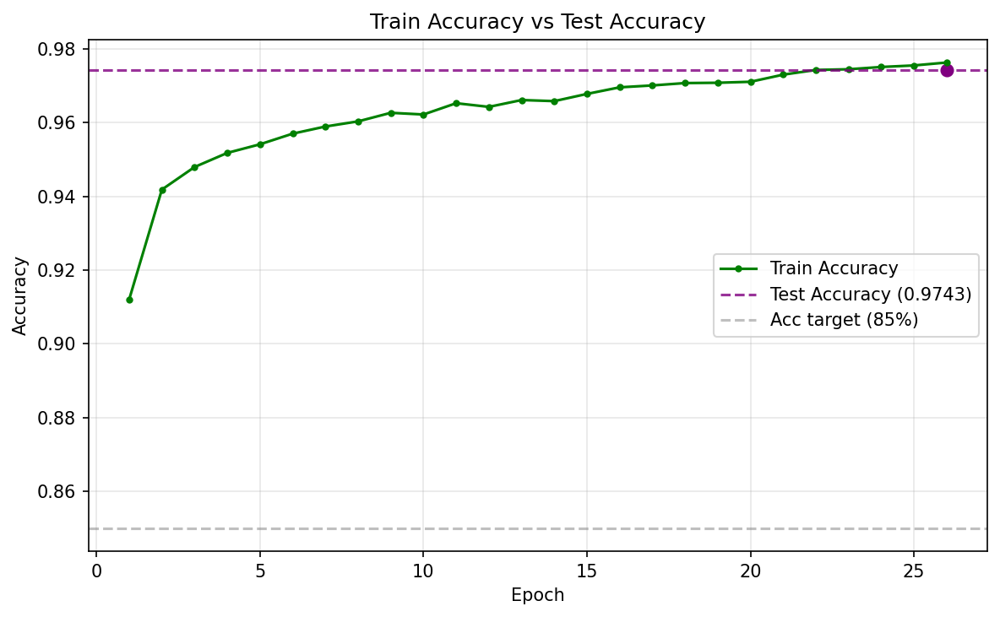
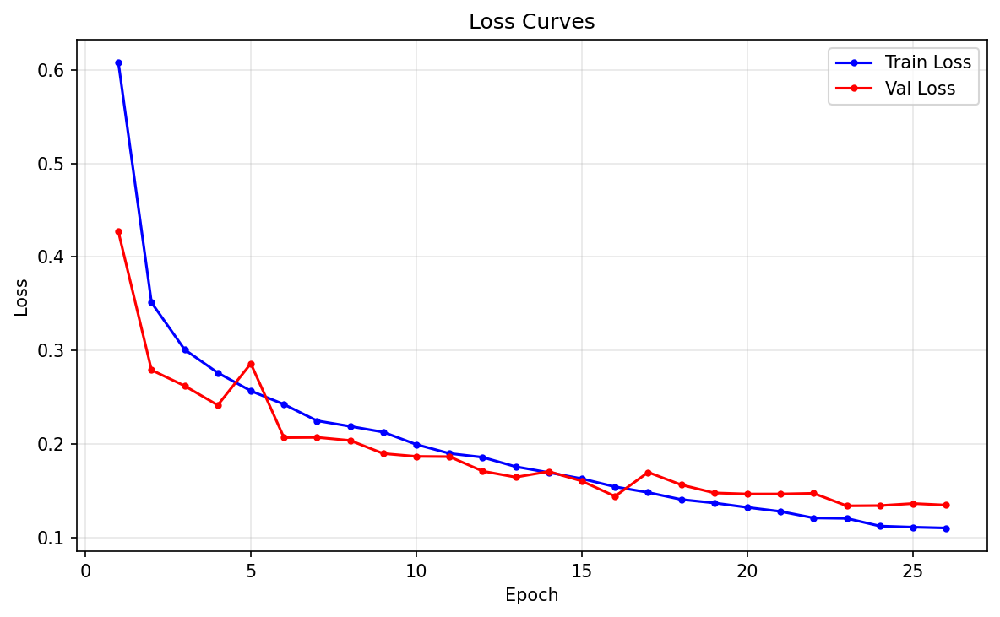
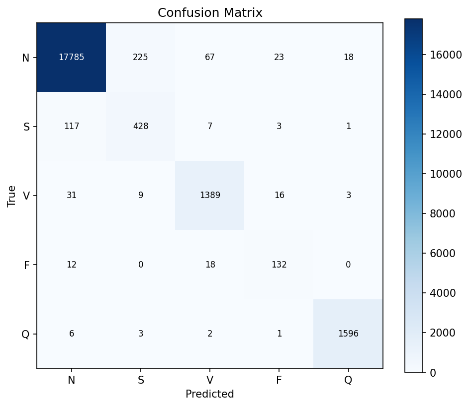
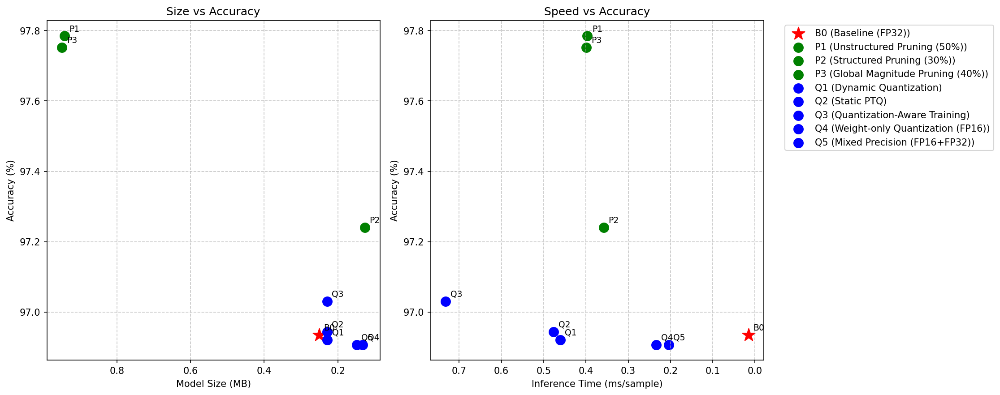

# Collective Intelligence for Edge ECG Diagnosis

> Optimizing and deploying deep-learning ECG arrhythmia classifiers across resource-constrained IoT nodes, then fusing their predictions through a weighted-voting collective intelligence layer with real-time supervision.

<p>
  
  
  
  
  
</p>

**Master's Project — Data Science, ENS Martil (Abdelmalek Essaâdi University)**
**Author:** Ayoub Aarab

---

## Overview

Deploying deep neural networks on embedded medical devices is constrained by tight memory, CPU, and latency budgets. This project investigates how a single high-accuracy ECG model can be compressed through **eight different optimization techniques**, deployed across **three simulated hardware tiers**, and combined into a **fault-tolerant collective decision system** that preserves diagnostic reliability while running on devices with as little as 500 MB of RAM.

The full lifecycle is automated end-to-end: from dataset selection and baseline training, through optimization and benchmarking, to multi-node consensus inference and live telemetry on a [ThingsBoard](https://thingsboard.io/) dashboard.

### Key Results

| Tier | RAM Budget | Champion Technique | Accuracy | Latency |
|------|-----------|--------------------|----------|---------|
| VM1  | 500 MB    | Static PTQ (Q2)         | 97.48 % | 138.5 ms |
| VM2  | 1 GB      | Structured Pruning (P2) | 97.73 % | 3.18 ms  |
| VM3  | 2 GB      | Global Magnitude (P3)   | 98.21 % | 1.02 ms  |

The collective layer achieved a **100 % consensus rate** and **100 % accuracy** on the evaluated specimen batch, with weighted voting based on each node's historical accuracy.

---

## System Architecture

```
                ┌─────────────────────────────────────────────┐
                │              Dataset (MIT-BIH)              │
                └──────────────────────┬──────────────────────┘
                                       │
                          ┌────────────▼────────────┐
                          │   ECGNet1D  Baseline    │   Phase 1
                          └────────────┬────────────┘
                                       │
          ┌────────────────────────────▼────────────────────────────┐
          │   Optimization — Quantization (Q1–Q5) + Pruning (P1–P3)  │   Phase 2
          └────────────────────────────┬────────────────────────────┘
                                       │
        ┌──────────────┬───────────────┼───────────────┬──────────────┐
        ▼              ▼               ▼               ▼              ▼
  ┌──────────┐   ┌──────────┐   ┌──────────┐    Performance Matrix   Phase 3
  │   VM1    │   │   VM2    │   │   VM3    │    + Champion Selection  Phase 4
  │  500 MB  │   │   1 GB   │   │   2 GB   │
  └────┬─────┘   └────┬─────┘   └────┬─────┘
       │ pred         │ pred         │ pred
       └──────────────┼──────────────┘
                      ▼
          ┌────────────────────────┐
          │  Aggregator (Weighted  │   Phase 5  — Collective Intelligence
          │   Voting + Consensus)  │
          └───────────┬────────────┘
                      │ MQTT telemetry
                      ▼
          ┌────────────────────────┐
          │   ThingsBoard / MQTT   │   Phase 6  — Supervision & Alerts
          └────────────────────────┘
```

---

## Dataset

The system is trained and evaluated on the **MIT-BIH Arrhythmia** database (Kaggle pre-processed CSV form): single-lead heartbeats resampled to 187 points and labelled into **5 AAMI classes**.

| Label | Class | Description                         |
|-------|-------|-------------------------------------|
| 0     | N     | Normal beat                         |
| 1     | S     | Supraventricular ectopic beat       |
| 2     | V     | Ventricular ectopic beat            |
| 3     | F     | Fusion beat                         |
| 4     | Q     | Unknown / unclassifiable beat       |

> Train: 87,554 samples · Test: 21,892 samples. Dataset-selection scoring across candidate datasets lives in [results/eda/](results/eda/).

## The Model

`ECGNet1D` ([models/ecg_net.py](models/ecg_net.py)) is a compact (~55K-parameter) 1-D convolutional network for single-lead ECG beat classification into the 5 AAMI classes, designed for embedded deployment. The repository also defines:

- `ECGNet1D_Narrow` — a channel-reduced variant produced by structured pruning.
- `QuantizableClassifier` / `FP16Wrapper` / `ManualMixedPrecisionWrapper` — wrappers enabling eager-mode quantization and mixed-precision inference. Consolidating these into a single module guarantees reliable `torch.load` across heterogeneous deployment environments.

## Optimization Techniques

Eight compression strategies are implemented under [optimization/](optimization/), each as a self-contained `optimize.py`:

| ID  | Technique                  | Family        |
|-----|----------------------------|---------------|
| Q1  | Dynamic Quantization       | Quantization  |
| Q2  | Static PTQ                 | Quantization  |
| Q3  | Quantization-Aware Training| Quantization  |
| Q4  | Weight-only FP16           | Quantization  |
| Q5  | Mixed Precision            | Quantization  |
| P1  | Unstructured Pruning       | Pruning       |
| P2  | Structured Pruning         | Pruning       |
| P3  | Global Magnitude Pruning   | Pruning       |

Champion selection ([optimization/select_best.py](optimization/select_best.py)) ranks techniques per tier using a weighted score over accuracy, latency, CPU, and memory footprint.

## Collective Intelligence

The aggregator ([collective/aggregator.py](collective/aggregator.py)) fuses the three champion nodes:

- **Weighted voting** — each node's vote is scaled by its historical accuracy and per-prediction softmax confidence.
- **Confidence gating** — collective decisions below the confidence threshold are flagged for re-validation.
- **Resource monitoring** — nodes exceeding CPU (> 85 %) or RAM (> 90 %) thresholds raise alerts via email and/or webhook.
- **Telemetry** — per-node and collective metrics are published over MQTT to ThingsBoard for live dashboards.

---

## Results Gallery

<table>
  <tr>
    <td align="center"><br><sub>Baseline accuracy evolution</sub></td>
    <td align="center"><br><sub>Training / validation loss</sub></td>
  </tr>
  <tr>
    <td align="center"><br><sub>Confusion matrix (5 AAMI classes)</sub></td>
    <td align="center"><br><sub>Accuracy vs. size/latency Pareto front</sub></td>
  </tr>
</table>

Additional plots — per-tier speed/size trade-offs and the full performance matrix — are in [results/optimization/](results/optimization/) and [results/phase3/](results/phase3/).

---

## Repository Structure

```
.
├── baseline/        # Baseline ECGNet1D training & evaluation
├── collective/      # Orchestrator + consensus aggregator
├── dataset/         # EDA notebooks and MIT-BIH preprocessing
├── deployment/      # Per-node edge inference engine (node_eval.py)
├── environment/     # Dockerfile, docker-compose, resource limits
├── models/          # ECGNet1D and optimization wrappers
├── notebooks/       # Phase 1–2 training/evaluation notebooks
├── optimization/    # 8 optimization techniques + comparison/selection
├── results/         # Saved metrics, plots, and per-phase reports
├── thingsboard/     # Dashboard JSON for cloud monitoring
├── run_phase3.py    # Performance-matrix sweep driver
├── MASTER_GUIDE.md  # Full command-by-command run guide
└── walkthrough.md   # Phase 3–6 results writeup
```

---

## Getting Started

### Prerequisites

- Python 3.13
- PyTorch 2.x
- Docker Desktop (for VM-tier simulation and ThingsBoard)
- The [MIT-BIH Arrhythmia](https://www.physionet.org/content/mitdb/) dataset (CSV form), mounted at `/mitbih`

### Installation

```bash
git clone <repository-url>
cd collective-intelligence
python -m venv .venv && source .venv/bin/activate
pip install -r requirements.txt
```

### Quick Start

```bash
# Phase 1 — Train the baseline model
python baseline/prepare_data.py
python baseline/train.py --epochs 20

# Phase 2 — Generate all 8 optimized variants
python optimization/compare_techniques.py

# Phase 3 — Benchmark every technique across the 3 VM tiers
docker compose -f environment/docker-compose.yml build
python run_phase3.py

# Phase 4 — Select the champion model per tier
python optimization/select_best.py

# Phase 5–6 — Launch the collective hub + supervision
docker compose -f environment/docker-compose.yml up -d thingsboard
python collective/orchestrator.py
```

The ThingsBoard UI is available at <http://localhost:8080>. See [MASTER_GUIDE.md](MASTER_GUIDE.md) for the complete, annotated command sequence and [walkthrough.md](walkthrough.md) for detailed results.

---

## Hardware Simulation

The three tiers are enforced via Docker `cpus` / `memory` limits in [environment/docker-compose.yml](environment/docker-compose.yml):

| Service | CPUs | Memory | Role                       |
|---------|------|--------|----------------------------|
| vm1     | 0.5  | 500 MB | Ultra-constrained edge node |
| vm2     | 1.0  | 1 GB   | Balanced edge node          |
| vm3     | 2.0  | 2 GB   | High-performance edge node  |

---

## License

This project was developed for academic purposes as part of a Master's program in Data Science at ENS Martil. Please contact the author before reuse.
